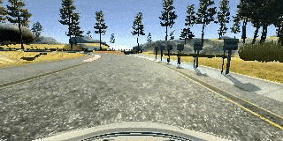

# CAR_BehavioralCloning
 Train a neural network to drive a car
 
 The goals / steps of this project are the following:
 * Use the simulator to collect data of good driving behavior
 * Build, a convolution neural network in Keras that predicts steering angles from images
 * Train and validate the model with a training and validation set
 * Test that the model successfully drives around track one without leaving the road
 * Summarize the results with a written report
 
 [//]: # (Image References)
 
 [image1]: ./image/three.png "left/center/right camera images"
 [image2]: ./image/flip.png "original vs. flip"
 [image3]: ./image/step12.png "step1 vs step2"
 [image4]: ./image/step34.png "step3 vs step4"
 [image5]: ./image/nvidia.png "Nvidia"
 [image6]: ./image/epochs35.png "3epochs vs 5epochs mse"
 [image7]: ./image/dropoutAB.png "dropoutAB"
 [image8]: ./image/withdropout.png "with/withoutDropout"
 
 ---
 ## Project Summary
This project includes the following files:
* model.py : containing the script to create and train the model
* drive.py : a Python script for driving the car in autonomous mode based on trained deep neural network model
* model.h5 containing a trained convolutional neural network  keras model
* readme.md : a report writeup file summarizing the results
* run1.mp4 : a video recording of simulation vehicle driving autonomously around the track

 #### **drive.py**
 Using the simulator and drive.py file, the car can be driven autonomously around the track by executing
 ```sh
 python drive.py model.h5
 ```

#### **video.py**
```sh
python video.py run1
```
Creates a video based on images found in the `run1` directory. The name of the video will be the name of the directory followed by `'.mp4'`, so, in this case the video will be `run1.mp4`.When executing, GPU mode should be disabled otherwise, it gets an error when finding ffmpeg module.

 #### **model.py**
 The model.py file contains the code for training and saving the neural network. The file shows the pipeline for training and validating the model and comments to explain how the code works. Detail data processing and a couple of different model architecture will be discussed in the next section.
 The code in model.py uses a Python generator to generate data for training rather than storing the training data in the memory. Generator helps preprocessing data can change data types from an int to a float, which can increase the size of the data by a factor of 4.
 
 ## Model Architecture and Training Strategy
 #### Data Collection
  During data collection, in order to capture good driving behavior, I first recorded driving the vehicle staying in the center of the road and aovided getting too close to the sides of the road for the first two laps.
 * the car stays in the center of the road as much as possible
 When reading each line from csv file ,driving_log.csv: - each row in this sheet with center/left/right images, the steering angle, throttle, brake, and speed of the car. each image is 160 pixels high and 320 pixels wide(1:20))
 Each row of the csv log file,  contains the file path for each camera as well as information about the steering measurement, throttle, brake and speed of the vehicle. However I only used the steering measurement value fonly.
 Here is an example image of left/center/right camera:
 ![left/center/right cam][image1]
 
 #### image read
 cv2.imread will get images in BGR format, while drive.py uses RGB. In order to keep the same image formatting I used openCV's BGR2RGB converting feature.
 ```code
 image = cv2.cvtColor(image, cv2.COLOR_BGR2RGB)
 ```

 ## Solution
 #### 1. Solution Design Approach
 When the model predictions are poor on both the training and validation set, I explored
 * data processing : data normalization , cropping pixels to focus on a specific area
 * increased the number of epochs: 3 --> 5 --> 7
 * added more convolutional layers to the network: LeNet (2 conv)--> Nvider(5 conv)
 * changed model architecture(LeNet -->Nvidia)
 * tried different Dropout strategy

 #### training vs. validating
 Using scikit-learn shuffle function: traning(80%) and validation(20%) data sets are splitted and randomly shuffled .
 ```code
 X_samples = np.array(images)
 y_samples = np.array(angles)
 yield sklearn.utils.shuffle(X_samples, y_samples)
 ```
 I shuffled the 24,108 data points randomly and put 80% of the data for training the model and put 20% of the data into a validation set so that 19,286 data points were used for training set and 4,822 data points for validation set.


 ### 2. Model Architecture
 The initial architecture is simple activation --> LeNet Architecture --> NVidia Architecture
 
 #### step1. simple activation vs. step2. Data Normalization
The model includes ReLU(Rectified Linear Unit) layers to introduce nonlinearity.
#### step2. Data normalization : Lambda layer
 The data is normalized in the model using a keras Lambda layer.
In Keras, lambda layers can be used to create arbitrary functions that operate on each image as it passes through the layer. The lambda layer will also ensure that the model will normalize input images when making predictions in drive.py.
That lambda layer could take each pixel in an image and run it through the code:
```code
model.add(Lambda(lambda x: (x / 255.0) - 0.5, input_shape=(160,320,3)))## pixel size is 255, 0.5 is offset
```
After normalization(step2) , the MSE dramatically has been lowered down from step1. However, among step2 epochs, a couple low MSE(mean squared error) on the training set but a high MSE(mean squared error) on the validation set is oberserved. This implies that the model was overfitting. And still there is a big mse value difference among epochs in step2.
Here are step1.step2 result:
![step1 vs step2][image3]

#### Attempts to reduce overfitting in the model
The model was trained and validated on different data sets to avoid overfitting.
In order to gauge how well the model was working, I splitted image and steering angle data into a training set(80%) and a validation set(20%) to avoid overfitting by using scikit-learn train_test_split method.
```code
from sklearn.model_selection import train_test_split
samples = list(zip(images, measurements))
train_samples, validation_samples = train_test_split(samples, test_size=0.2)
```

#### step3. LeNetArchitecture
 Applied LeNet Archiecture which consists of two sets of convolutional and Max pooling layers, followed by a flattening layer, then two fully-connected layers.
 A CNN(convolutional neural network) with 3x3 filter sizes and depths between 32 and 64 (model.py lines 18-24) is used. This model shows a better performance comapred to step 2 in the following performance result on the left esp on the 1st epochs.
 
 ![step3 vs step4][image4]
 #### step4. LeNet+Flipping image+cropping top/botton pixel
 #### cropping images: Cropping2D(cropping=((60,25), (0,0))
 The cameras in the simulator capture 160 pixel by 320 pixel images. Not all of these pixels contain useful information, for example, the top portion of the image captures trees and hills and sky, and the bottom portion of the image captures the hood of the car. In order to train faster I cropped each image to focus on only the portion of the image that is useful for predicting a steering angle by using keras [Cropping2D layer](https://keras.io/api/layers/convolution_layers/#cropping2d) for choosing an area of interest that excludes the sky and/or the hood of the car.
 ```code
model.add(Cropping2D(cropping=((70,25), (0,0))))
 ```
 This crops 70 rows pixels from the top of the image , 25 rows pixels from the bottom of the image and 0 columns of pixels from the left/right of the image.
 
 ### flipping images
 A effective technique for helping with the left turn bias involves flipping images and taking the opposite sign of the steering measurement using openCV flip() method:
 ```code
 images.append(cv2.flip(image,1))
 angles.append(measurement*-1.0)
 ```
 Here is an example image of flipped image:
 ![original vs. flipped image][image2]

#### step5. Nvidia archiecture
  ##### modified NVIDIA architecture
  Applied NVIDIA 's [end-to-end deep learning  for self-driving cars](https://arxiv.org/pdf/1604.07316v1.pdf): which consists of 9 layers, including an image normalization layer, 5 convolutional layers, and 3 fully connected layers. The first layer of the network performs image normalization using keras Lambda. Performing normalization in the network allows the normalization scheme to be altered with the network architecture, and to be accelerated via GPU processing.
  Plus, applied solely convlutional network with (2x2) strides rather than adding Maxpooling by following [this paper](https://arxiv.org/abs/1412.6806) ; "max-pooling can simply be replaced by a convolutional layer with increased stride without loss in accuracy"

 Here is a visualization of the Nvidia architecture
 ![Nvidia model][image5]
 After appying Nvidia model, the gap between training loss vs. validation loss is negligeble. The performance is way better than any other experiment.
 #### step6. multiside cam images + Nvidia architecture
 In this project, there are three camera images were provided ; left/center/right camera images. The differences among three images are as follows:
 from the perspective of the left camera, the steering angle would be less than the steering angle from the center camera where as from the right camera's perspective, the steering angle would be larger than the angle from the center camera. For adjustment, I used correction=0.2 to add or subtract from the center image's steering angle value for left/right cam images.
 ```code
 steering_center = float(row[3]) ##reading 4th column from csv file
 correction = 0.2 # this is a parameter to tune
 steering_left = steering_center + correction
 steering_right = steering_center - correction
 ```
 This way, I can train model how to steer if the car drifts off to the left or the right. This helps raising up the number of traning images however, the performance was not dramatically changed from using just center image only. If the car was off-from the center, then this can help some cases where the car is off the center and teaches it to steer back to the center of the lane.
 
 For both step 5&6, the vehicle is able to drive autonomously around the track without leaving the road.--> stable final model architecture.
 
 And on top of splitting Train/validation/sets, Dropout layers were also applied in order to reduce overfitting in the final model.
 
 ### Dropout layer
 When the model predicts well on the training set too much but slightly poor on the validation set (overfitting)
 By Applying Dropout , I can see the overfitting on the trained set was smoothened 
 ![with/withoutDropout][image8]
 * did not try pooling layers, according to paper as I mentioned above
 * tried adding Dropout layers (1. right after each fully connected layer vs. 2. right after each convolutional layer)
 However, applying dropout on the 5 convlutional lavers vs. 3 fully connected layers does not any bid differnce in the Ndivia model.
 ![droupoutAB][image7]
 
 * added further augmented data set: to augment the data, I flipped the images over y-axis in the next step.
 
 #### Model Compile and parameter tuning
For the performance measure, mean squared error is used. Once model is loaded, compile/ tune the model with Adam Optimizer and MSE (Mean Squred Error). I used an Adam Optimizer so the learning rate was tuned automatically
 ```code
 model.compile(optimizer='adam', loss='mse')
 ```
 #### validating model
 In order to validate a model, I compared model performance on the training set and a validation set. The validation contains image and steering angle data that was not used for training : validation_generator

 The validation set helped determine if the model was overfitting. In Keras, the model.fit() or model.fit_generator() methods have a verbose parameter that tells Keras to output loss metrics as the model trains. Even though model.fit_generator() was deprecated, I still use this method to specify a python generator. However, model.fit() works to for applying generator as well in the keras 2 API. When calling model.fit() or model.fit_generator(), Keras outputs a history object that contains the training and validation loss for each epoch.
 ```code
 history_object = model.fit_generator(train_generator, samples_per_epoch = len(train_samples), validation_data = validation_generator,nb_val_samples = len(validation_samples),nb_epoch=5, verbose=1)
 ```
  I finalized 3 epochs for training. Any more does not reduce the MSE.
  ![epochs35][image6]
  
 #### training and saving model
 Used Keras(under tensorflow) Model to train a network and save :
 1. X(input features): Images from the center/left/right camera of the car.
 2. y(Output/label): a new steering angle for the car.
 3. Save trained model architecture as model.h5 using model.save('model.h5').
 ```code
 from tensorflow.keras.models import load_model
 model.save('model')  # creates a HDF5 file 'model.h5'
 ```
 #### testing model
 Once model is satisfied, after launching the simulator and entering autonomous mode , I can see how the car navigates based on trained model by executing. The vehicle stays on the track.
 ```code
 python drive.py model.h5
 ```
 
 #### Result
 After driving two laps in the simulator, I was able to generate driving images and train them to learn 
 - one lap focusing on smoth driving on the curve
 - one lap focusing on accelerating speed in the straight line vs curved line 
 - especially focusing on recevery driving when approaching to side blocks 
NVIDIA architecture was applied and the [Video](video.mp4) was recorded during the first lap from autonomous driving according the final model.
The result shows autonomous vehicle's adaptive driving behavior on the most dramatic curved line.


 #### More data collection that I could try ...
 1. Recovery Lap: to avoid the car seers off to the side in a sharp drive, to recover back to center
 2. Driving Counter-Clockwise: helping the model more generalized
 3. use both tracks  -->  collecting data from the second track in order to generalize the model
 4. collecting more data
  - two or three laps of center lane driving(Done)
 - one lap of recovery driving from the sides
 - one lap focusing on driving smoothly around curves(Done)
 - rapid curve or bridge on the water(Done)
